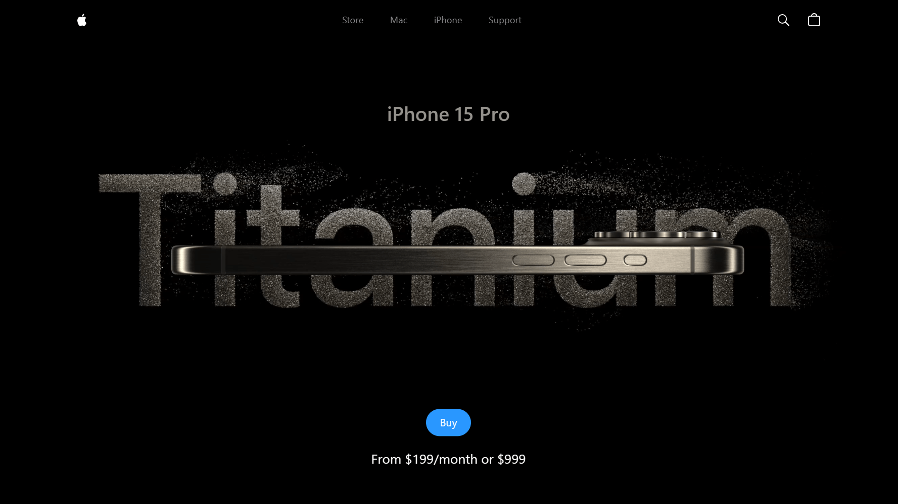

<div align="center">
    <a href="https://iphone15-fv.vercel.app" target="_blank">
      
    </a>
  <h3 align="center">iPhone 15 UI</h3>
</div>

##  <br /> 📋 <a name="table">Table of Contents</a>

- ✨ [Introduction](#introduction)
- ⚙️ [Tech Stack](#tech-stack)
- 📝 [Features](#features)
- 🚀 [Quick Start](#quick-start)

##  <br /> <a name="introduction">✨ Introduction</a>

**[EN]** This is a clone of Apple's iPhone 15 Pro website using React.js and TailwindCSS. It highlights the effective use of GSAP (Greensock Animations) and Three.js for displaying iPhone 15 Pro models in various colors and shapes.

**[FR]** Ceci est un clone du site web de l'iPhone 15 Pro d'Apple utilisant React.js et TailwindCSS. Il met en avant l'utilisation efficace de GSAP (Greensock Animations) et de Three.js pour afficher les modèles d'iPhone 15 Pro dans diverses couleurs et formes.

##  <br /> <a name="tech-stack">⚙️ Tech Stack</a>

- [**React**](https://react.dev/reference/react) is a JavaScript library for building user interfaces, developed by Facebook. React.js allows developers to create reusable UI components that manage their own state, leading to more efficient and predictable code. It is widely used for developing single-page applications (SPAs) due to its virtual DOM that improves performance and ease of maintenance.
  
- [**Three.js**](https://threejs.org/docs/) is a powerful JavaScript library that simplifies the creation of 3D graphics in the browser using WebGL. Three.js provides a wide range of features for rendering, animation, and interaction with 3D objects, making it a popular choice for building immersive web experiences, including games, data visualizations, and interactive art.
  
- [**Three Fiber**](https://docs.pmnd.rs/react-three-fiber/getting-started/introduction) is a React renderer for Three.js, which allows developers to build 3D graphics using React components. By leveraging React's component-based architecture and hooks, React Three Fiber makes it easier to manage complex 3D scenes, reuse code, and integrate with other React-based libraries and tools.
  
- [**Three Drei**](https://github.com/pmndrs/drei) is a collection of useful helpers and abstractions for React Three Fiber, designed to simplify common tasks and reduce boilerplate code. React Three Drei includes components for lighting, controls, physics, and other essential features, enabling developers to quickly set up and customize their 3D scenes.

- [**GSAP**](https://gsap.com/docs/v3/) (Greensock) is a robust animation library for creating high-performance, professional-grade animations in JavaScript. GSAP (GreenSock Animation Platform) offers a wide range of features, including smooth transitions, complex sequences, and cross-browser compatibility. It is known for its speed and flexibility, making it a popular choice for animating web and mobile applications.

- [**Vite**](https://vitejs.dev/guide/) is a modern build tool that provides a fast and efficient development environment with hot module replacement (HMR). Vite is designed to be a lean and extensible alternative to traditional bundlers like Webpack. It leverages native ES modules and a development server to deliver near-instantaneous updates during development, significantly improving developer productivity.

- [**Tailwind**](https://v2.tailwindcss.com/docs) is an utility-first CSS framework that allows developers to build custom designs quickly by composing utility classes directly in their markup. Tailwind CSS promotes a different approach to styling compared to traditional CSS frameworks by providing a set of low-level utility classes that can be combined to achieve any design. This leads to faster development, easier maintenance, and a more consistent design system.

## <br/> <a name="features">📝 Features</a>

👉 **Beautiful Subtle Smooth Animations using GSAP**: Enhanced user experience with seamless and captivating animations powered by GSAP.

👉 **3D Model Rendering with Different Colors and Sizes**: Explore the iPhone 15 Pro from every angle with dynamic 3D rendering, offering various color and size options.

👉 **Custom Video Carousel (made with GSAP)**: Engage users with a unique and interactive video carousel developed using GSAP for a personalized browsing experience.

👉 **Completely Responsive**: Consistent access and optimal viewing on any device with a fully responsive design that adapts to different screen sizes.

## <br /> <a name="quick-start">🚀 Quick Start</a>

Follow these steps to set up the project locally on your machine.

**Prerequisites**

Make sure you have the following installed on your machine:

- [Git](https://git-scm.com/)
- [Node.js](https://nodejs.org/en)
- [npm](https://www.npmjs.com/) (Node Package Manager)

<br/>**Cloning the Repository**

```bash
git clone {git remote URL}
```

<br/>**Installation**

Let's install the project dependencies, from your terminal, run:

```bash
npm install
# or
yarn install
```

<br/>**Running the Project**

Installation will take a minute or two, but once that's done, you should be able to run the following command:

```bash
npm run dev
# or
yarn dev
```

Open [`http://localhost:5173`](http://localhost:5173) in your browser to view the project.
